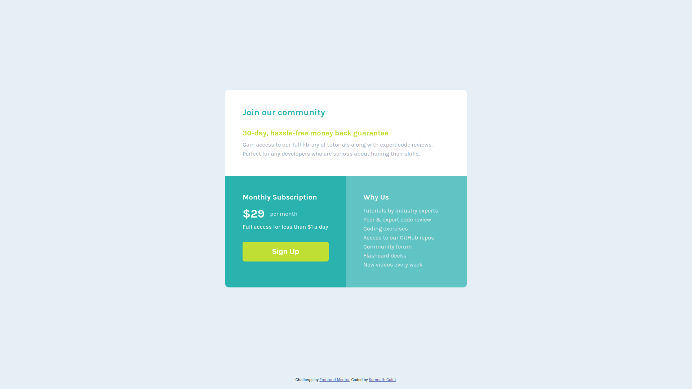

# Frontend Mentor - Single price grid component solution

This is a solution to the [Single price grid component challenge on Frontend Mentor](https://www.frontendmentor.io/challenges/single-price-grid-component-5ce41129d0ff452fec5abbbc). Frontend Mentor challenges help you improve your coding skills by building realistic projects.

## Table of contents

- [Overview](#overview)
  - [The challenge](#the-challenge)
  - [Screenshot](#screenshot)
  - [Links](#links)
  - [Built with](#built-with)
- [Author](#author)

## Overview

Single price grid component

### The challenge

Users should be able to:

- View the optimal layout for the component depending on their device's screen size
- See a hover state on desktop for the Sign Up call-to-action

### Screenshot

Desktop view

Mobile view

### Links

- Solution URL: [Solution URL here](https://www.frontendmentor.io/solutions/single-price-grid-component-2AI5AJ2pX1)
- Live Site URL: [Live site URL here](https://github.com/somu-code/Single-price-grid-component)

### Built with

- Semantic HTML5 markup
- CSS custom properties
- Flexbox
- CSS Grid

## Author

- Frontend Mentor - [@somu-code](https://www.frontendmentor.io/profile/somu-code)
- Twitter - [@GoluiSomnath](https://www.twitter.com/GoluiSomnath)
